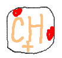
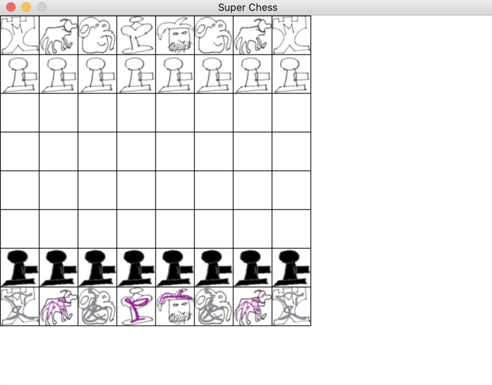

<p align="center">
  <a href="https://github.com/EgorovM/chess_python">
    
  </a>

  <h3 align="center">Шахматы на Python</h3>

  <p align="center">
    Революция новой игры в сфере гейминга
    <br />
    <a href="https://github.com/EgorovM/chess_python/issues">Report Bug</a>
    ·
    <a href="https://github.com/EgorovM/chess_python/issues">Request Feature</a>
  </p>
</p>


<details open="open">
  <summary>Содержимое</summary>
  <ol>
    <li>
      <a href="#о-проекте">О проекте</a>
    </li>
    <li>
      <a href="#хочу-сыграть">Хочу сыграть!</a>
      <ul>
        <li><a href="#подготовка">Подготовка</a></li>
        <li><a href="#запуск">Запуск</a></li>
      </ul>
    </li>
    <li><a href="#лицензия">Лицензия</a></li>
    <li><a href="#контактные-данные">Контактные данные</a></li>
    <li><a href="#другие-проекты">Другие проекты</a></li>
  </ol>
</details>


## О проекте



Нашей целью не было ущемление чувств меньшиств.

## Хочу сыграть!

Не спеши сильно, программа не пирожок - не остынет. Сама игра написана на языке программирования Python 3.8.7. Для запуска, нужно его установить :)

### Подготовка

Сначала нужно установить библиотеку pygame. 

```sh
$ pip install pygame
```

### Запуск

Нужно запустить главный файл игры - main.py

```sh
$ python3 main.py
```


## Лицензия

Свободно распостраняется под лицензией MIT.

## Контактные данные

Егоров Мичил - [@michilegorov](https://twitter.com/michilegorov) - egorovmichil9@gmail.com

Проект: [https://github.com/EgorovM/chess_python](https://github.com/EgorovM/chess_python)


<!-- ACKNOWLEDGEMENTS -->
## Другие проекты
* [Python Snake](https://www.github.com/EgorovM/snake)
* [C++ Snake](https://www.github.com/EgorovM/cpp_snake)
